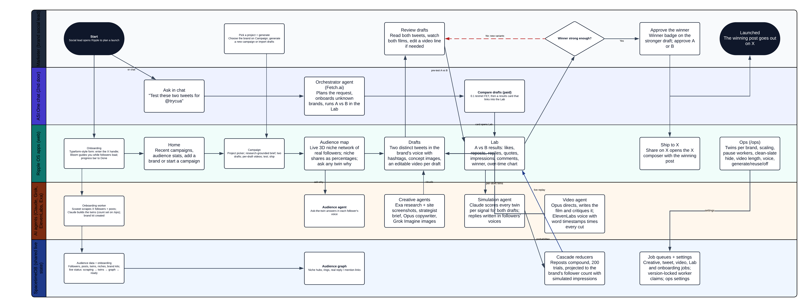
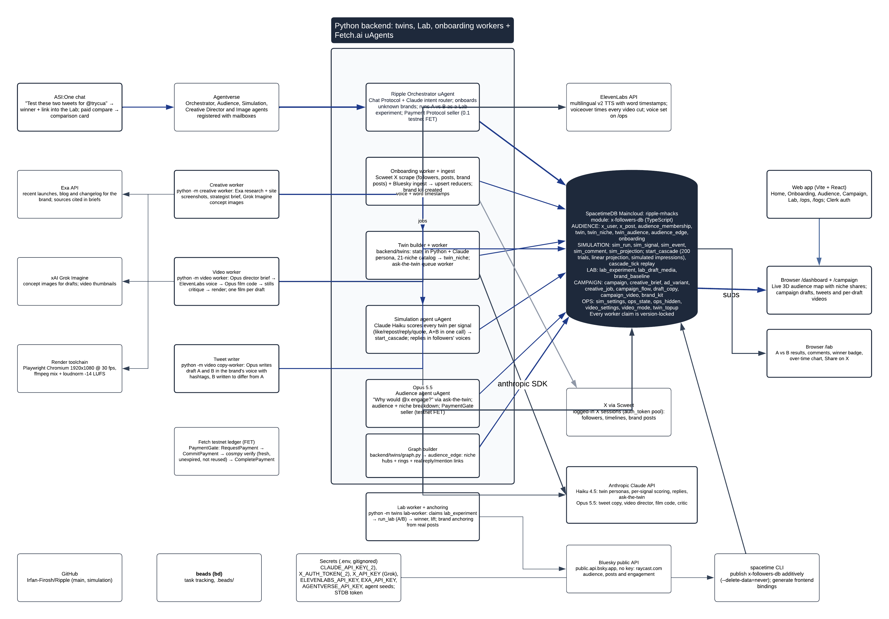

# Ripple

**See the ripple before you post.** Ripple builds AI twins of a brand's real X audience, has a team of agents create the campaign, and tests every draft on the twins before anything goes live.

Winner at MHacks 2026 · Live demo: [ripple-mhacks.vercel.app](https://ripple-mhacks.vercel.app)

## What it does

1. **Twin the audience.** Enter an X handle. Ripple reads the brand's real followers and builds a Claude Haiku twin for each one from who they follow and what they post, then maps the twins into interest niches.
2. **Generate the campaign.** Exa researches the brand's latest launches, a campaign agent (Claude Opus) writes two drafts with different angles, Grok Imagine creates concept images, and a video agent renders a film for each draft, voiced by ElevenLabs and timed to its word timestamps.
3. **Test it in the Lab.** Every twin decides in character whether to like, repost, reply or quote. Reposts cascade to the reposters' followers, results are projected to the full audience, and the winner ships to X in one click.
4. **Ask from anywhere.** Ripple is a Fetch.ai agent on Agentverse, so the whole flow also runs from ASI:One chat.

Results are synthetic stress tests grounded in public posts, not validated predictions of individual behaviour. Twins never infer sensitive traits such as race, religion, health, sexual orientation, politics or income.

## User flow

## Infrastructure

## Stack

| Layer | Technology |
| --- | --- |
| Database and server logic | SpacetimeDB (TypeScript module on Maincloud): tables, reducers, job claims and real-time subscriptions |
| Frontend | React, TypeScript, Vite, Clerk, Recharts |
| Workers | Python 3.12 with uv: onboarding, Lab simulation, creative, tweet writer and video |
| Models and APIs | Claude Haiku and Opus (Anthropic), ElevenLabs, xAI Grok Imagine, Exa |
| Agents | Fetch.ai uAgents on Agentverse, ASI:One chat |
| Video rendering | Playwright (Chromium) and FFmpeg |
| X data | Scweet with a pool of logged-in sessions (not the official X API) |

## Fetch.ai agents

Talk to **@ripple** in [ASI:One](https://asi1.ai), for example "Research @supermemory" or "Compare @supermemory. A: '…' B: '…'". Chat follows the same Audience → Concepts → Test → Launch flow as the web app.

| Agent | Address | Role |
| --- | --- | --- |
| `ripple` (orchestrator) | `agent1qvq9ea8vhcvwure28rvzzdjp23k2ffnmcq0d6sed9thmn85kvam5jvqdrlj` | ASI:One entry point. Plans each request and delegates. |
| `ripple-audience` | `agent1qvl0y3yn06476jkk6wpzj638x0hjh4ws87wgs4200k83n4ugk0nk65ruxnw` | Finds who in the audience cares about a topic and interviews the relevant twins. |
| `ripple-creative-director` | `agent1qwnufkenp53ewr5rfqxprkvx04ztes96xqmw32uvcegd4674dh5ajkfva3y` | Research, campaign concepts, post copy, videos and approvals. |
| `ripple-image-gen` | `agent1q0ed307u95982pv35ecz3ekr5u9l6eckx6nfcswahtyp56f4fgv9x7muyse` | Generates and saves campaign images. |
| `ripple-simulation` | `agent1qtcpquer88v9q83t3p7t83cwjkt9m5t9lt2etw435c04grerdzw26ve3d2f` | Runs the same A/B experiments shown in the web Lab. |

Setup and the full chat walkthrough: [docs/fetch-ai-demo.md](docs/fetch-ai-demo.md).

## Repository

| Path | Contents |
| --- | --- |
| `x-followers-db/` | SpacetimeDB module (`src/index.ts`) and the X follower ingest (`ingest/`) |
| `backend/twins/` | Twin builder, onboarding worker and Lab simulation worker |
| `backend/creative/` | Research, brief and concept image worker |
| `backend/video/` | Tweet writer and video worker |
| `backend/ripple_agents/` | Fetch.ai agents |
| `frontend/` | Web app: landing, Home, Audience, Campaign, Lab, `/ops` and `/logs` |
| `scripts/` | Fetch.ai demo launcher and preflight checks |
| `docs/` | Architecture diagrams and the Fetch.ai demo guide |

## Team

Built by Ansh and Irfan at MHacks 2026.
